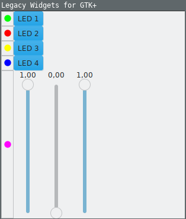

# legacy\_widgets\_for\_gtk

I felt like there were no widgets for building classic fron-panel like GUIs.
E.g. I was missing LEDs. This project contains some of these (currently only
LEDs), which are probably considered `legacy technology' or at least legacy
style as of tody. I mean, in the age of the flat ui, who cares about LEDs?

Regarding licensing: Like always, I was too lazy to apply a license / could
not decide upon one. Feel free to do whatever you like with this code. I mean,
It's available on the internet, anyway, who could stop you? ;-)
